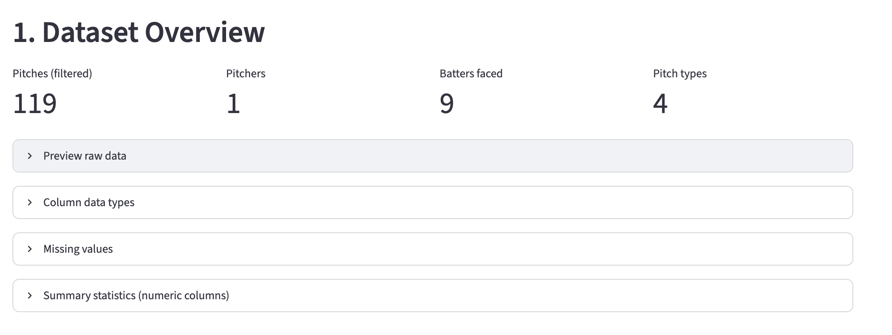
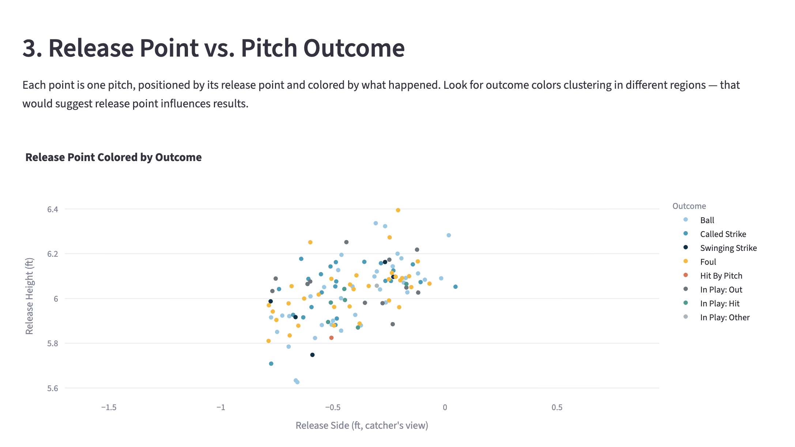
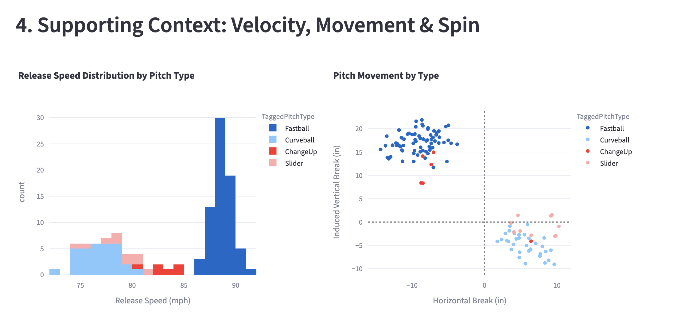
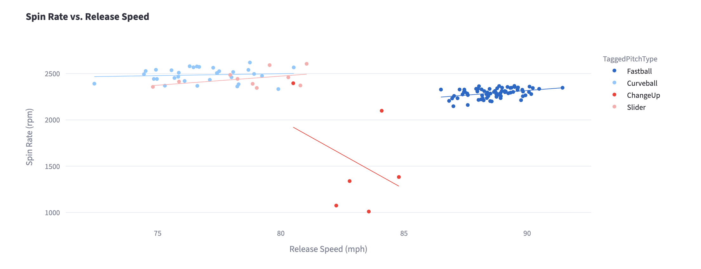
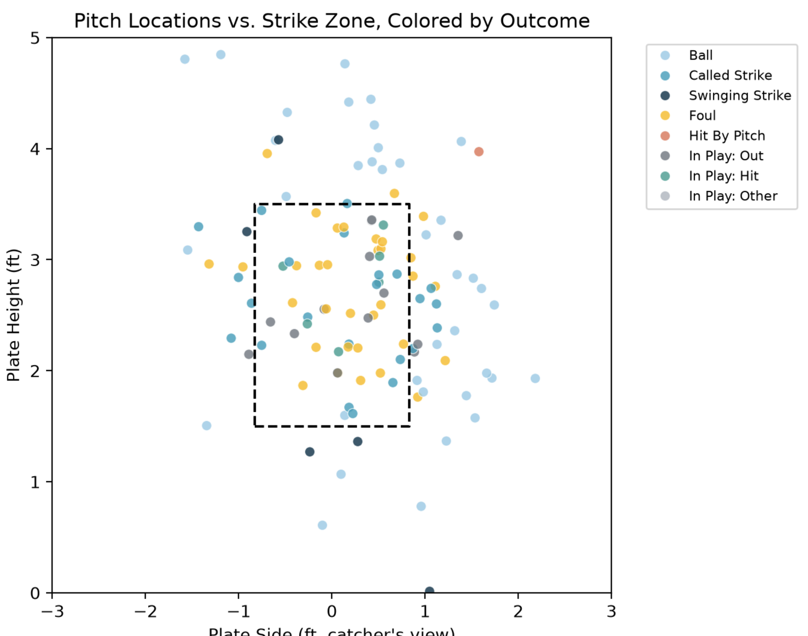

# ⚾ FinchField Pitch Tracking — EDA Explorer

A Streamlit app that performs exploratory data analysis (EDA) on a real
college baseball pitch-tracking dataset, with a focus on one question:

> **Does *where* a pitcher releases the ball relate to *what happens* to the pitch?**

The app lets you filter by pitcher, pitch type, and outcome, and visualizes
release point (height, side, extension) against pitch results — balls,
called strikes, whiffs, fouls, and balls in play.

## Dataset

`data/pitch_data.csv` — a TrackMan pitch-by-pitch export from a college
game at FinchField on 2025-06-09 (Coastal Plain League). 315 pitches,
8 pitchers, 20 batters faced, 6 pitch types. The raw export has 167
tracking columns; the app keeps the ~30 relevant to pitch/at-bat analysis
(velocity, spin, movement, release point, location, and outcome).

*Note: file is marked "unverified" by the source system — used here for
educational EDA purposes only.*

## Features

1. **Dataset Overview** — shape, dtypes, missing values, summary statistics
2. **Release Point Landscape** — release point clusters by pitcher and pitch type
3. **Release Point vs. Pitch Outcome** *(core analysis)* — scatter plot and
   box plots of release height/side grouped by outcome, plus release
   extension vs. exit speed for balls in play
4. **Supporting Context** — velocity distributions, pitch movement profile,
   spin rate vs. velocity
5. **Strike Zone Location** — pitch locations relative to the rulebook zone,
   colored by outcome

All charts are interactive (Plotly) except the strike-zone plot, which uses
Matplotlib/Seaborn.

## Tech Stack

- [Streamlit](https://streamlit.io/) — app framework
- [pandas](https://pandas.pydata.org/) / [numpy](https://numpy.org/) — data wrangling
- [Plotly](https://plotly.com/python/) — interactive charts
- [Matplotlib](https://matplotlib.org/) / [Seaborn](https://seaborn.pydata.org/) — static charts
- [uv](https://docs.astral.sh/uv/) — dependency management

## Running Locally

```bash
# clone the repo
git clone <YOUR_REPO_URL>
cd streamlit-eda-project

# install dependencies with uv (creates .venv automatically)
uv sync

# launch the app
uv run streamlit run app.py
```

The app opens at `http://localhost:8501`.

## Screenshots

> Generated by running the app locally with `uv run streamlit run app.py`.

### Overview & Filters


### Release Point vs. Outcome (core analysis)


### Release Height/Side Box Plots by Outcome


### Pitch Movement & Velocity


### Strike Zone Location


## Project Structure

```
streamlit-eda-project/
├── app.py                # Streamlit app
├── data/
│   └── pitch_data.csv    # dataset
├── screenshots/          # README screenshots
├── pyproject.toml        # dependencies (managed with uv)
├── uv.lock
└── README.md
```

## Author

Bryson Poe
